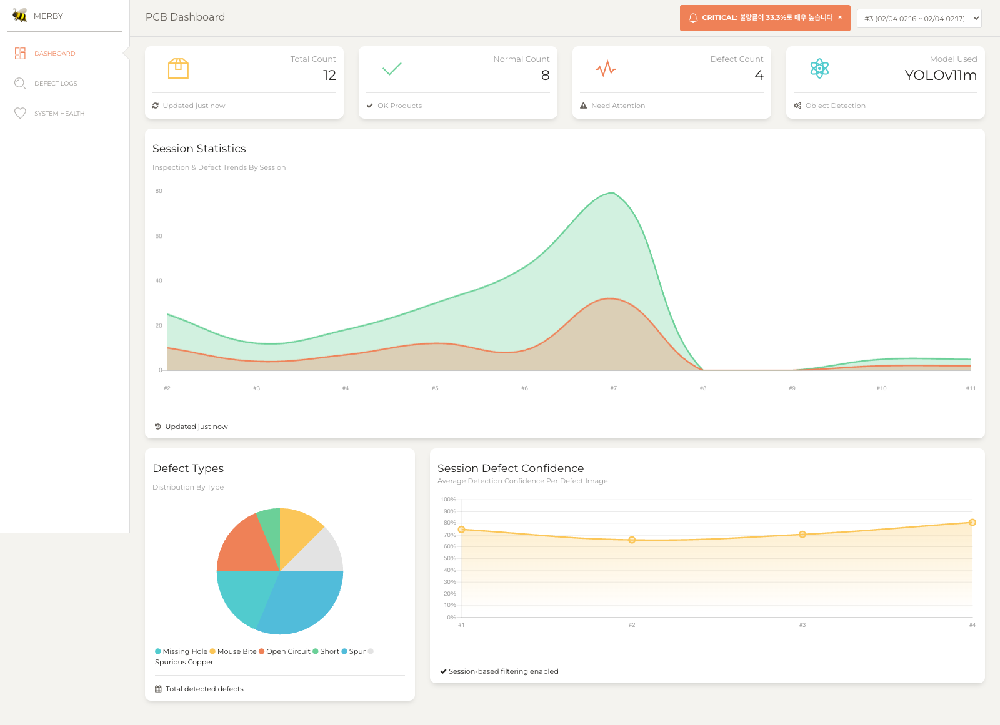
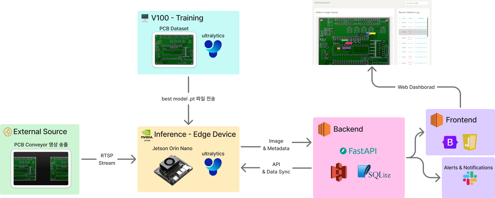
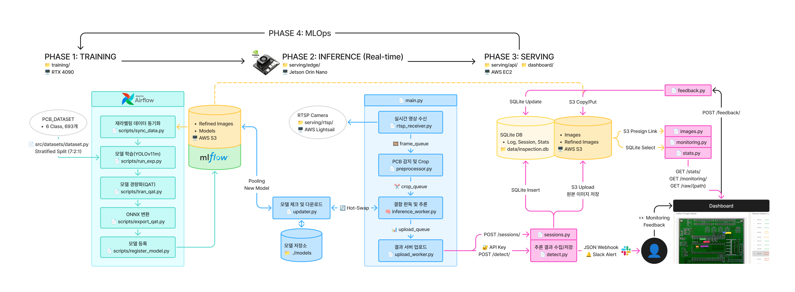

<div align="right">

[](README.md)
[](README_EN.md)

</div>

<div align="center">

# 🍇 PODO

### **P**CB **O**nly **D**etected **O**nce

*Real-time Edge AI System for PCB Defect Detection*

[](https://python.org)
[](https://fastapi.tiangolo.com)
[](https://docs.ultralytics.com)
[](https://opencv.org)
[](https://aws.amazon.com)

<br />

[**Live Demo**](http://3.35.182.98/) · [**API Docs**](http://3.35.182.98:8080/docs) · [**Demo Video**](https://youtu.be/7DkqRYQfxBg?si=3mS4f99RSzwpcFdx)

[**📄 Wrap-up Report**](https://www.notion.so/Wrap-up-REPORT-3043e9d89def8047952bf4abe70fbeee) · [**📊 Presentation**](docs/pdf/presentation.pdf)

</div>

<br />

<div align="center">

| mAP@50 | Recall | Inference Speed | Optimization |
|:---:|:---:|:---:|:---:|
| **96.0%** | **100%** | **33.8 FPS** | **2.4x** |
| Near-perfect detection accuracy | Zero false negatives | Real-time at 30fps | TensorRT QAT INT8 |

</div>

<br />

---

## 📋 Table of Contents

- [Project Overview](#-project-overview)
- [Demo](#-demo)
- [Project Documentation](#-project-documentation)
- [System Architecture](#-system-architecture)
- [Tech Stack](#-tech-stack)
- [Model Training & Optimization](#-model-training--optimization)
- [Getting Started](#-getting-started)
- [Project Structure](#-project-structure)
- [API Specification](#-api-specification)
- [Team](#-team)

---

## 🔍 Project Overview

Manual visual inspection of PCB defects (scratches, holes, etc.) in manufacturing is slow and inconsistent.
**PODO** captures PCBs moving on a conveyor belt in real-time and runs inference instantly on an Edge AI device (Jetson Orin Nano) using a YOLOv11 model to automatically detect defects.
The model is trained on the **PKU-Market-PCB** dataset, ensuring high detection performance optimized for practical environments.
Inference results are stored in a backend server and AWS Storage, enabling real-time monitoring through a dashboard.

### Key Features

> - 🎥 Automatic PCB detection and cropping from RTSP video stream
> - ⚡ Real-time defect detection on edge devices using YOLOv11 + QAT optimized models
> - 📊 Real-time dashboard with defect rate, confidence distribution, and defect type statistics
> - 🔔 Threshold-based alert system (Slack integration)
> - 🔄 MLOps pipeline: quality manager feedback → automatic relabeling → S3 storage for retraining

---

## 🎬 Demo

> ⚠️ Click the image to play on YouTube.

<div align="center">

[](https://youtu.be/tuqKpfCxpP8?si=HThj3WSvIL54_XSo)

**🌐 Live Demo**: http://3.35.182.98/

<sub>⚠️ The server will be available until the end of March 2026.</sub>

</div>

### Dashboard



---

## 📚 Project Documentation

| Document | Description |
|:---------|:------------|
| 📄 [**Wrap-up Report**](https://www.notion.so/Report-314e2c74d1c48050938af774141a8d7b?source=copy_link) | Complete project process and results (Notion) |
| 📊 [**Presentation**](docs/pdf/presentation_e4ds.pdf) | Final presentation slides (PDF) |

---

## 🏗 System Architecture

### System Overview


### System Architecture


## Data Flow

1. **RTSP Server (Lightsail)** — Streams PCB footage via RTSP protocol
2. **Edge (Jetson Orin)** — Receives RTSP stream → Background subtraction for PCB cropping → YOLO inference → Sends results to backend
3. **Backend (EC2 / FastAPI)** — Stores inference results and images in DB/S3, provides statistics API, triggers Slack alerts
4. **Frontend (EC2 / nginx)** — Real-time dashboard for inspection monitoring + feedback submission
5. **Feedback → Re-labeling** — Quality inspectors submit per-bbox feedback (false positive / false negative / class correction), which auto-generates corrected YOLO labels saved to S3 `refined/`
6. **Auto Retraining (RunPod / Airflow)** — Weekly auto-trigger syncs data from S3 `refined/` → FP32 training → QAT quantization → ONNX export → MLflow model registration
7. **Auto Deployment (Edge OTA)** — Edge device periodically polls S3 for new models → TRT engine build → Golden Set performance validation → Hot-Swap for zero-downtime model replacement on pass


---

## 🛠 Tech Stack

| Module | Technologies |
|:-------|:-------------|
| **Backend** | `FastAPI` `SQLite (aiosqlite)` `Pydantic` |
| **Edge** | `Python` `OpenCV` `NumPy` `Threading/Queue` |
| **Frontend** | `HTML/CSS/JS` `Bootstrap (Paper Dashboard)` |
| **Training** | `YOLOv11` `QAT (Quantization-Aware Training)` |
| **RTSP** | `MediaMTX` `H.264` |
| **MLOps** | `S3 (relabeled datasets)` `Slack Webhook (alerts)` |
| **Infrastructure/CI** | `GitHub Actions` `AWS (EC2, S3, Lightsail)` `systemd` `nginx` |

---

## 🧠 Model Training & Optimization

We benchmarked **24 model variants** across 3 sizes (Nano/Small/Medium) x 4 resolutions (640~1600px) x 2 versions (v8/v11) to select the optimal model.

### Key Results (V100 GPU)

| Model | Resolution | mAP50 | Recall | FPS | Notes |
|:------|:----------:|:-----:|:------:|:---:|:------|
| YOLOv11n | 960px | 0.9662 | 1.0 | 44.79 | Best cost-performance |
| **YOLOv11m** | **640px** | **0.9620** | **1.0** | **46.23** | **✅ Deployment Standard** |
| YOLOv8s | 1280px | 0.9776 | 1.0 | 40.03 | High-performance alternative |
| YOLOv11m | 960px | 0.9742 | 1.0 | 37.66 | High-performance alternative |

### Edge Optimization (Jetson Orin Nano)

| Stage | Method | FPS | Latency | mAP50 | Recall |
|:------|:-------|:---:|:-------:|:-----:|:------:|
| Step 1 | TensorRT FP16 | 30.7 | 32.6ms | 0.9586 | 1.0 |
| Step 2 | PTQ (INT8) | 36.8 | 27.2ms | 0.9487 | 1.0 |
| **Step 3** | **QAT (INT8)** | **33.8** | **29.6ms** | **0.9602** | **1.0** |

> 💡 **Custom QAT Pipeline**: Ultralytics default export not supported → Built Deep Recursive Injection + EMA Trainer + Re-calibration from scratch

### Final Selection: `YOLOv11m + TensorRT QAT INT8`

- Maintains FP32-level accuracy while maximizing inference speed (~**2.4x** faster than PyTorch)
- **33.8 FPS** enables real-time processing of all frames from 30fps video source

---

## 🚀 Getting Started

### Prerequisites

- Python >= 3.11
- [uv](https://docs.astral.sh/uv/) (package manager)
- (Edge) NVIDIA Jetson Orin + YOLO model file

### Backend

```bash
cd serving/api
uv sync --active
uv run uvicorn main:app --reload --port 8000
```

> 📖 API Docs: http://localhost:8000/docs

### Edge Device

```bash
cd serving/edge
uv sync --active
uv run python main.py --input rtsp://YOUR_RTSP_URL
```

| Option | Description | Default |
|:-------|:------------|:-------:|
| `--input`, `-i` | RTSP URL or video file | RTSP server address |
| `--loop`, `-l` | Loop video file playback | False |
| `--debug`, `-d` | Debug mode (save crops) | False |

### Frontend

Serve static files from the `dashboard/` directory using nginx.

```bash
# Configure nginx to proxy /api/* to backend
sudo systemctl start nginx
```

---

## 📁 Project Structure

```
.
├── serving/
│   ├── api/                    # Backend (FastAPI)
│   │   ├── main.py             #   Application entry point
│   │   ├── routers/            #   API routers (detect, stats, monitoring, feedback ...)
│   │   ├── database/           #   SQLite integration
│   │   ├── schemas/            #   Pydantic models
│   │   ├── config/             #   Settings (Slack, alert thresholds, etc.)
│   │   └── utils/              #   Image processing, Slack alerts
│   ├── edge/                   # Edge preprocessing + inference (Jetson)
│   │   ├── main.py             #   Pipeline main loop
│   │   ├── preprocessor.py     #   PCB detection/cropping
│   │   ├── rtsp_receiver.py    #   RTSP receiving thread
│   │   ├── inference_worker.py #   Inference worker
│   │   └── upload_worker.py    #   Result upload worker
│   └── rtsp/                   # RTSP streaming server
├── dashboard/                  # Frontend (HTML/JS)
├── training/                   # Model training (YOLOv11 + QAT)
├── docs/                       # Documentation
└── .github/workflows/          # CI/CD (GitHub Actions)
```

### 📚 Documentation

| Module | Docs |
|:-------|:-----|
| 🎨 Frontend | [docs/frontend.md](docs/frontend.md) |
| ⚙️ Backend | [docs/backend/](docs/backend/) |
| 🔧 Edge | [docs/edge.md](docs/edge.md) |
| 🧠 Training | [docs/training.md](docs/training.md) |
| 📡 RTSP | [docs/rtsp.md](docs/rtsp.md) |

---

## 📡 API Specification

| Method | Endpoint | Description |
|:------:|:---------|:------------|
| `POST` | `/detect` | Receive edge inference results (multi-defect support) |
| `GET` | `/stats` | Inspection statistics (defect rate, confidence, FPS, etc.) |
| `GET` | `/latest` | Recent inspection history (n items) |
| `GET` | `/defects` | Defect type aggregation |
| `GET` | `/monitoring/health` | System health status (session-based filtering) |
| `GET` | `/monitoring/alerts` | Alert queries (for frontend polling) |
| `POST` | `/feedback/bulk` | Multi-bbox feedback + automatic relabeling |
| `GET` | `/feedback/stats` | Feedback statistics (MLOps) |
| `GET` | `/feedback/queue` | Labeling queue query |
| `GET` | `/feedback/export` | Retraining dataset info (S3 paths) |

<details>
<summary><b>POST /detect Request Example</b></summary>

```json
{
  "timestamp": "2026-01-18T15:01:00",
  "image_id": "PCB_002",
  "image": "base64_encoded_string",
  "detections": [
    {"defect_type": "scratch", "confidence": 0.95, "bbox": [10, 20, 100, 120]},
    {"defect_type": "hole", "confidence": 0.92, "bbox": [300, 350, 320, 380]}
  ]
}
```

</details>

---

## 👥 Team

<table>
<tr>
<td align="center" width="20%" style="border: 2px solid #e0e0e0; border-radius: 10px; padding: 20px;">

<br />
<b>Kyungmo Kim</b>
<br />
<code>Frontend</code> <code>Modeling</code>
<br />
<sub>Web dashboard development, MLOps implementation, model optimization</sub>
</td>
<td align="center" width="20%" style="border: 2px solid #e0e0e0; border-radius: 10px; padding: 20px;">

<br />
<b>Jee-eun Kim</b>
<br />
<code>Backend</code> <code>MLOps</code> <code>CI/CD</code> <code>AWS</code>
<br />
<sub>FastAPI/DB design, MLOps features, GitHub Actions CI/CD, AWS EC2 management</sub>
</td>
<td align="center" width="20%" style="border: 2px solid #e0e0e0; border-radius: 10px; padding: 20px;">

<br />
<b>Jungho Wi</b>
<br />
<code>Modeling</code> <code>AWS</code>
<br />
<sub>YOLO-based modeling and optimization, AWS S3 management</sub>
</td>
<td align="center" width="20%" style="border: 2px solid #e0e0e0; border-radius: 10px; padding: 20px;">

<br />
<b>Bonghak Lee</b>
<br />
<code>Edge Device</code>
<br />
<sub>Jetson Orin Nano setup and inference system implementation</sub>
</td>
<td align="center" width="20%" style="border: 2px solid #e0e0e0; border-radius: 10px; padding: 20px;">

<br />
<b>Subin Cho</b>
<br />
<code>PM</code> <code>AWS</code> <code>RTSP</code>
<br />
<sub>Project management, network security, RTSP video streaming, AWS Lightsail</sub>
</td>
</tr>
</table>

---

## 📄 License

This project was created as part of the Boostcamp AI Tech program by NAVER Connect Foundation.
