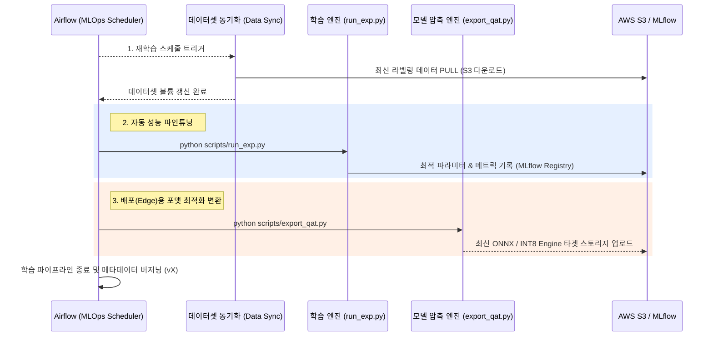

# PCB Defect Detection with YOLO (Modularized)

이 프로젝트는 **YOLOv11**을 사용하여 PCB(Printed Circuit Board) 결함을 탐지하기 위한 모듈화된 파이프라인입니다. 동적 모듈 로딩, 오프라인 증강(Offline Augmentation), **QAT/KD 모델 적용**, **MLflow 및 Airflow 기반의 자동 MLOps** 기능을 제공합니다.

## 📂 프로젝트 구조 (Project Structure)

```text
.
├── configs/                 # 통합 설정 파일 (config.yaml, config_kd.yaml 등)
├── dags/                    # Airflow 기반 모델 재학습 파이프라인
├── scripts/                 # 실행 스크립트 묶음
│   ├── run_exp.py           # 메인 실행 스크립트 (학습 및 추론)
│   ├── train_qat.py         # TensorRT 배포를 위한 QAT 학습 스크립트
│   ├── train_kd.py          # 지식 증류(KD) 학습 스크립트
│   └── export_qat.py        # QAT ONNX 강제 Export 스크립트
├── pretrained_weights/      # YOLO 사전 학습 가중치 저장소 (예: yolov11m.pt)
├── PCB_DATASET/             # 원본 데이터셋 (이미지 및 XML 라벨)
├── runs/                    # 실험 결과물 저장소 (CSV, 시각화 등)
├── mlruns/                  # MLflow 로컬 측정 및 모델 레지스트리
└── src/
    ├── datasets/            # 데이터셋 로드 모듈 (XML->YOLO 변환, 7:2:1 분할)
    ├── models/              # 모델 팩토리 (YOLO 동적 로딩)
    ├── qat/                 # QAT 핵심 로직 모듈 (EMA, Deep Injection)
    ├── utils/               # 유틸리티 (시드 고정, 스크립트 헬퍼)
    ├── train.py             # 트레이너 클래스 (커스텀 콜백 통합)
    └── inference.py         # 추론 매니저 (CSV 생성 담당)
```

## 🚀 빠른 시작 (Quick Start)

### 1. 필수 사항 (Prerequisites)
- Python 3.8 이상
- [uv](https://github.com/astral-sh/uv) (필수)

이 프로젝트는 `uv`를 통해 의존성을 관리합니다. `requirements.txt`는 별도로 존재하지 않으며, `pyproject.toml`과 `uv.lock`을 사용합니다.

```bash
# 의존성 설치 (uv.lock 기반 동기화)
uv sync
```

### 2. 가중치 준비 (Prepare Weights)
사용할 사전 학습 모델 가중치(예: `yolov11m.pt`)를 `pretrained_weights/` 폴더에 넣어주세요.
코드가 자동으로 해당 폴더에서 가중치를 찾습니다.

### 3. 실험 실행 (Run Experiment)

**1. 일반 베이스라인 학습 (Fine-Tuning)**

가장 기본이 되는 YOLOv11m 모델의 파인튜닝 과정입니다.
```bash
# 기본 설정으로 실행
python scripts/run_exp.py --config configs/config.yaml
```

**2. QAT (Quantization-Aware Training) 배포 파이프라인**

Edge 하드웨어 가속을 위한 INT8 양자화 모델 학습 및 엔진 추출 과정입니다.
```bash
# 단계 1: QAT 학습 (가중치 이동평균 EMA 적용)
python scripts/train_qat.py --config configs/config.yaml

# 단계 2: QAT 통계 오차 재보정 (Re-calibration)
python scripts/recalibrate_ema.py --weights runs/baseline_v11m_qat/weights/best_ema.pt --data PCB_DATASET/data.yaml

# 단계 3: 프레임워크 검증 로직을 우회하는 QAT 강제 ONNX 추출 (Deep Injection)
python scripts/export_qat.py --weights runs/baseline_v11m_qat/weights/best_ema_recalib.pt
```

**3. 지식 증류 (Knowledge Distillation)**

대형 Teacher 모델(v11x)의 성능 상한을 경량 Student 모델(v11n)에 이식시키는 전략입니다.
- Gradient Bypass(1x1 Conv)를 차단하는 AT(Attention Transfer) 및 커리큘럼 기반 FGFI 기법 지원
```bash
# 설정 파일(config_kd.yaml)에서 Teacher/Student 모델 지정 후 실행
python scripts/train_kd.py --config configs/config_kd.yaml
```

이 명령어들을 실행하면 데이터 준비부터 학습, 검증, 최종 추론 테스트(`submission.csv` 생성)까지 각 파이프라인의 **자동 진행 과정**이 시작됩니다.

## ⚙️ 설정 가이드 (`config.yaml`)

`config.yaml` 파일 하나로 파이프라인 전체를 제어할 수 있습니다. 각 항목에 대한 자세한 주석이 달려 있습니다.

```yaml
# 1. 실험 이름 (Experiment Name)
exp_name: "baseline_v11m"     # 결과 폴더: runs/baseline_v11m/

# 2. 모듈 선택 (Module Selection)
dataset_module: "dataset"     # 'dataset_aug'로 변경 시 오프라인 증강 적용
model_module: "yolo"          # 일반 YOLO 모델 (또는 qat 등 커스텀 모델 설정)
model: "yolo11m"              # 기준 모델

# 3. 학습 파라미터 (Training Params)
epochs: 180
optimizer: 'AdamW'            # 옵션: 'SGD', 'Adam', 'AdamW', 'auto'
scheduler_type: 'cosine'      # 옵션: 'linear', 'cosine'
lrf: 0.1                      # 종료 시 Learning Rate 비율 제한
device: '0'                   # GPU Device ID (예: '0,1' 또는 'cpu')
seed: 42                      # 재현성을 위한 Random Seed

# 4. 가중치 및 증강 제어 - YOLOv11 성능 개선 설정 (예시)
cls: 2.0                      # 분류 위주 학습 (Recall 및 mAP50 우선)
mosaic: 1.0                   # Mosaic Prob (0.0 ~ 1.0)
scale: 0.5                    # Scale Gain
mixup: 0.0                    # Mixup Prob
# ... (기타 모든 YOLO 파라미터 지원)
```

## 📊 결과물 (Outputs)

모든 결과물은 `runs/{exp_name}/` 폴더에 저장됩니다:

- **가중치 (Weights)**: `runs/{exp_name}/weights/best.pt` (최고 성능 모델)
- **추론 결과 (Inference)**: `runs/{exp_name}/inference/submission.csv` (테스트 파일 예측 결과)
- **탐지 시각화 (Detect)**: `runs/{exp_name}/detect/` (검증/테스트 이미지 시각화 결과)
- **로그 및 모델 레지스트리 (Logs)**: `mlruns/` (로컬 MLflow 기반의 학습 메트릭 기록 및 최고 가중치 보관)

---

## 🚀 MLOps (학습 관점의 모델 재학습 파이프라인)

본 Training 코드는 단발성 수동 학습에 그치지 않고, Apache Airflow(`dags/pcb_retrain.py`)에 의해 주기적으로 호출되어 **데이터 동기화부터 모델 변환 및 레지스트리 적재까지 전면 자동화**되어 있습니다. 

### Training 모듈 실행 구조도 (Airflow DAG 기준)



### Training 모듈 관점의 MLOps 이점

1. **지속적 학습(Continuous Training)**: S3에 새로운 데이터가 적재되면, 개발자의 개입 없이 이 레포지토리의 `scripts/` 코드들이 순차적으로 실행되며 모델 성능을 스스로 끌어올립니다.
2. **손쉬운 배포 변환 지원**: 베이스라인 학습뿐 아니라 Edge 배포를 위해 반드시 필요한 QAT 학습, Re-calibration, Engine 강제 추출 등의 무거운 과정을 `export_qat.py` 단일 스크립트 실행으로 묶어 자동화해두었습니다.
